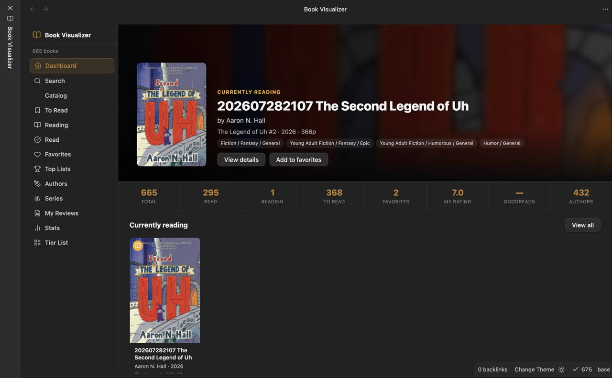
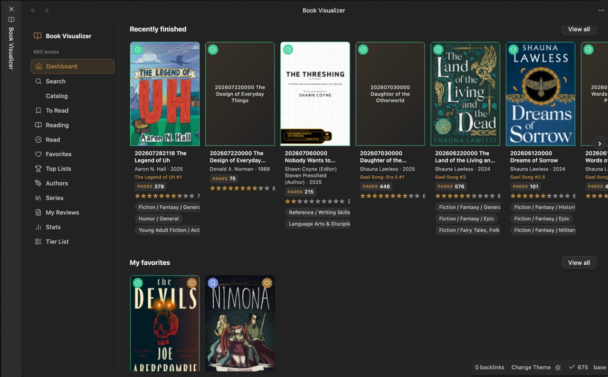
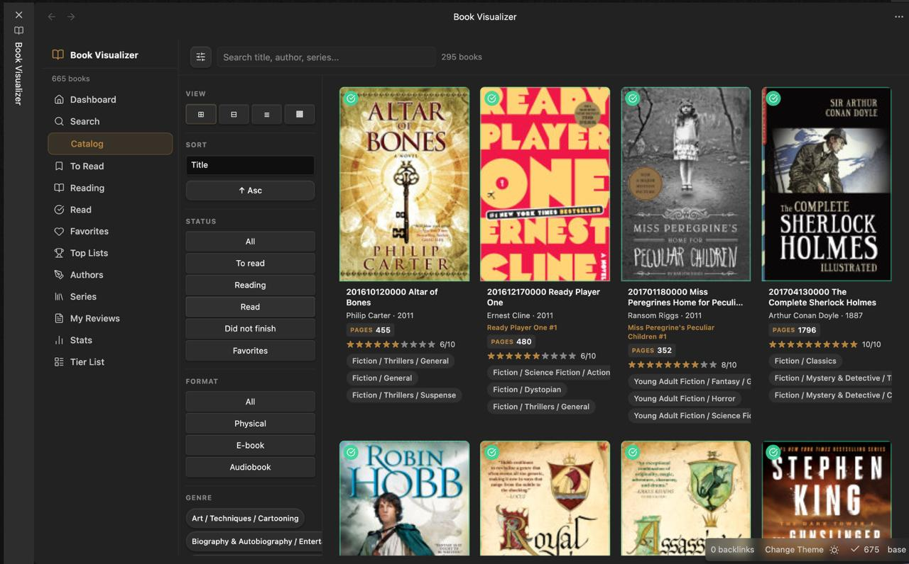
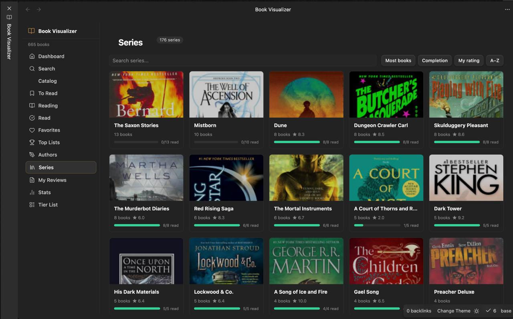
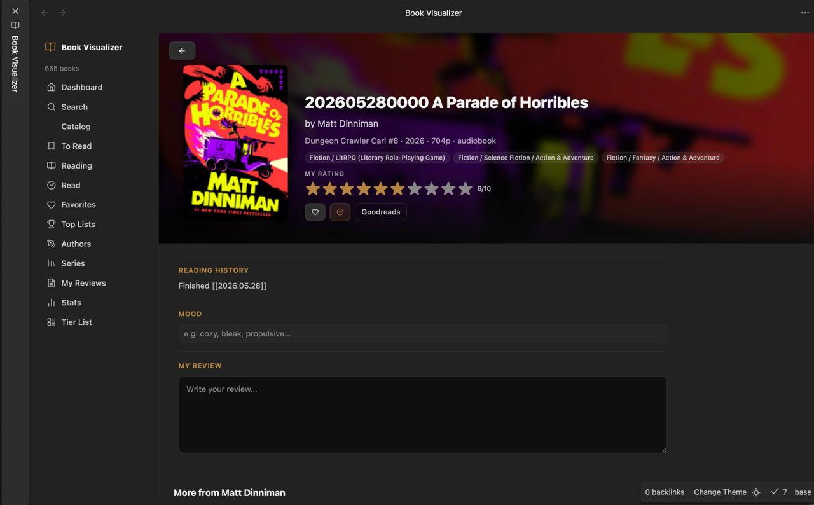

# Book Visualizer

A visual catalog plugin for [Obsidian](https://obsidian.md) that turns your book notes into a full-featured reading dashboard — hero banner, carousels, top lists, author stats, series completion tracking, tier lists, reading progress, and more.

> **No external services required.** Everything is read directly from the frontmatter of your vault notes.

Inspired by [**LDR | Movie Visualizer**](https://github.com/ldr-devx/ldr-obsidian-movie-visualizer) by **LDR_Dev** — this plugin follows the same architecture and UX philosophy (client-side routed views over an in-memory index built from note frontmatter), but every field, view, and detail layout is designed for books from scratch, not a relabeled copy. See [Attribution & License](#attribution--license).

---

## Screenshots

### Dashboard



### Catalog


### Series


### Book Detail


---

## Features

### Dashboard
- **Hero banner** — features whatever you're currently reading, falling back to your highest-rated or top-Goodreads book
- **Stats bar** — total, read, reading, to-read, favorites, avg personal rating, avg Goodreads score, unique authors
- **Carousels** — Currently Reading, Recently Finished, My Favorites, Top Rated, To Read
- Running total of pages read across your library

### Catalog
- Grid of every book, lazily rendered in batches as you scroll
- Filter by genre, status (to-read / reading / read / DNF / favorites), format (physical / ebook / audiobook), year range, rating, Goodreads score, author, series, and free-text search
- Sort by title, year, Goodreads score, rating, pages, finished date, started date, times read, author, series
- Four display modes: Large Grid, Compact Grid, List, Poster

### Top List
- Rank by combined score, personal rating, or Goodreads score
- Drag-and-drop custom ordering, persisted per vault

### Authors
- Cards per author: book count, read count, average personal rating, average Goodreads score
- Click through to an author's full bibliography in your vault

### Series
- **Book-specific — no movie analog.** Cards per series with a completion bar (`n/total read`)
- Click into a series to see every entry in reading order (by `seriesNumber`), each with its status, rating, and a one-click jump to the note

### Tier List
- Drag-and-drop tiering with customizable tier labels and colors, persisted per vault

### Reviews
- Every book with a `review` field, sorted by rating

### Stats
- Books by genre, by format, and my-rating distribution (bar charts)
- Books-by-publication-year and books-finished-by-year timelines (sparkline charts)
- Top authors by book count

### Search
- Full-text search across title, author, series, genre, and synopsis

### Book Detail
- Cover, all scores (Goodreads + personal), author(s), series position, synopsis
- **Reading progress bar** — current page / total pages, shown while status is `reading`
- Review, mood, format, ISBN/ISBN-13, awards, tags

---

## Installation

There is no GitHub release yet, so install via **BRAT** (Beta Reviewers Auto-update Tool):

1. Install the **BRAT** community plugin from Obsidian's Community Plugins browser and enable it.
2. In BRAT: **Add Beta Plugin** → paste this repository URL:
   `https://github.com/esttorhe/obsidian-book-visualizer`
3. Enable **Book Visualizer** in **Settings → Community Plugins**.
4. Click the **book-open** ribbon icon, or run the command **Open Book Visualizer**.

### Build from source

```bash
git clone https://github.com/esttorhe/obsidian-book-visualizer.git
cd obsidian-book-visualizer
npm install
npm run build   # tsc typecheck + esbuild production bundle → main.js
npm test        # run the vitest unit suite
```

Copy `main.js`, `styles.css`, and `manifest.json` into
`<your-vault>/.obsidian/plugins/book-visualizer/` and enable the plugin.

---

## Frontmatter reference

The plugin indexes **any note** whose frontmatter `categories` contains `Books` (case-insensitive, e.g. `books`). Only `categories` is required — everything else is optional and handled gracefully when missing.

```yaml
---
title: Piranesi
titleOriginal: Piranesi
isbn13: 9781635575637

author:
  - Susanna Clarke
series: ""              # omit or leave blank for standalone books
seriesNumber:
year: 2020               # publication year
publisher: Bloomsbury
pages: 245
language: English
genre:
  - Fantasy
  - Literary Fiction
format: physical          # physical | ebook | audiobook

scoreGoodreads: 4.34
rating: 9                 # your personal score 1–10 (supports 0.5 steps)

cover: https://...        # cover image URL
coverBackdrop: https://...

status: read               # to-read | reading | read | dnf (see below)
favorite: true
started: 2024-02-01        # ISO date
finished: 2024-02-10       # ISO date
currentPage:                # only meaningful while status is "reading"
timesRead: 1
review: A quietly strange, deeply moving book.
mood: contemplative

plot: A man lives in a house that is the world...
awards: Women's Prize for Fiction (2021)
tags:
  - favorites
categories:
  - Books
---
```

### Field notes

| Field | Type | Notes |
|---|---|---|
| `author` | string[] | Supports co-authors. |
| `series` / `seriesNumber` | string / number | Powers the **Series** view's completion tracking and reading order. Leave both unset for standalone books. |
| `pages` | number or string | Accepts a plain number, or text like `"352 pages"` / `"1,024"` — the digits are extracted. |
| `format` | `physical` \| `ebook` \| `audiobook` | Common spellings (`paperback`, `hardcover`, `kindle`, `epub`, `audible`, …) are normalized. |
| `plot` | string | The book's synopsis/blurb. Named `plot` (not `synopsis`) to match the same field name used by the movie/TV visualizer, so the same term is used consistently across this vault's media notes. `synopsis` is accepted as a fallback if `plot` isn't present. |
| `status` | `to-read` \| `reading` \| `read` \| `dnf` | If omitted or unrecognized, it's **inferred**: a `finished` date or `timesRead > 0` → `read`; a `started` date or `currentPage > 0` → `reading`; otherwise `to-read`. Common synonyms (`currently-reading`, `finished`, `abandoned`, `want-to-read`, …) are also normalized. |
| `currentPage` | number | Reading progress while `status: reading`; the detail view shows a progress bar (`currentPage / pages`). |
| `rating` | number 1–10 | Your personal score, 0.5 steps supported. |
| `scoreGoodreads` | number | External score, e.g. Goodreads' 1–5 scale. |
| `timesRead` | number | Reread count. |

---

## Obsidian Clipper integration

The included `clipper.json` has a template for the [Obsidian Clipper](https://obsidian.md/clipper) extension targeting **Goodreads** book pages (`categories: [Books]`, saved under `Books/`), triggered on `goodreads.com/book/show`.

> ⚠️ **Selectors are best-effort, not verified against a live page.** Goodreads' DOM structure wasn't inspected directly while building this template, and Goodreads changes its markup over time. Treat the clipper as a starting point — check the clipped values (especially `year`, `pages`, `publisher`, and `isbn13`, which currently share overlapping selectors that may need to be split apart) and fill in or correct fields by hand as needed.

---

## Obsidian Base view

`Books.base` is a companion [Bases](https://help.obsidian.md/bases) database file. It includes pre-built table views: **All**, **To-Read**, **Currently Reading**, **Favorites**, **By Author**, **By Series**, **By Genre**.

Copy `Books.base` to any folder inside your vault (e.g. `Books/Books.base`).

---

## Compatibility

| Target | Status |
|---|---|
| Obsidian 1.4.0+ | Supported |
| Desktop | Supported |
| Mobile | Supported |

---

## Attribution & License

This plugin's architecture and UX pattern were inspired by [**LDR | Movie Visualizer**](https://github.com/ldr-devx/ldr-obsidian-movie-visualizer) by **LDR_Dev** — the idea of an Obsidian `ItemView` reading a frontmatter-driven catalog into routed dashboard/catalog/top-list/tier-list/stats views, with zero external API calls. The book domain model, frontmatter contract, and every view (in particular Series, which has no movie equivalent) were designed and implemented fresh for this plugin.

Licensed under the [MIT License](LICENSE) — Copyright (c) 2026 Esteban Torres.

```bash
npm run dev    # esbuild watch mode
npm run build  # production build
npm test       # unit tests
```
